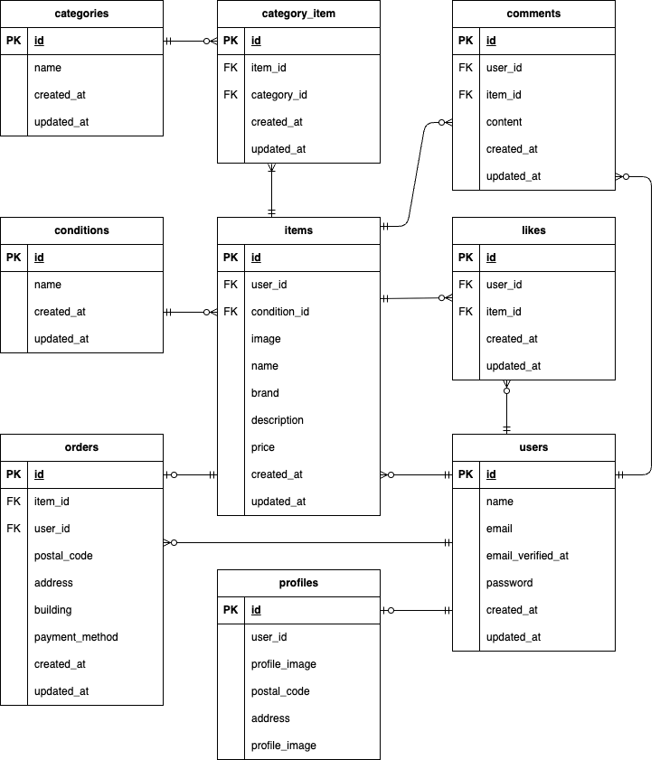

# coachtech-flea-market-test

## 環境構築

Dockerビルド

1.  git clone https://github.com/YumiOotake/coachtech-flea-market-test.git
2.  docker-compose up -d --build

Laravel環境構築

1.  docker-compose exec php bash
2.  composer install
3.  .env.exampleファイルから.envを作成
    cp .env.example .env

    以下を編集：
    ```
    DB_CONNECTION=mysql
    DB_HOST=mysql
    DB_PORT=3306
    DB_DATABASE=laravel_db
    DB_USERNAME=laravel_user
    DB_PASSWORD=laravel_pass

    STRIPE_PUBLIC_KEY=your_public_key
    STRIPE_SECRET_KEY=your_secret_key
    ```
    StripeのAPIキーは以下から取得してください。
    https://dashboard.stripe.com

4.  php artisan key:generate
5.  php artisan migrate
6.  php artisan db:seed
7.  php artisan storage:link

## メール認証設定（Mailtrap）

1. [Mailtrap](https://mailtrap.io)にアクセスしてアカウント登録
2. Email Testing → Inboxes → 自分のInboxを選択
3. SMTP Settings → Integrations で「Laravel 8+」を選択
4. 表示された内容を`.env`に設定

以下を編集：
```
MAIL_MAILER=smtp
MAIL_HOST=sandbox.smtp.mailtrap.io
MAIL_PORT=2525
MAIL_USERNAME=your_username
MAIL_PASSWORD=your_password
MAIL_ENCRYPTION=tls
MAIL_FROM_ADDRESS="hello@example.com"
MAIL_FROM_NAME="${APP_NAME}"
```

## 使用技術(実行環境)

- PHP 8.1
- Laravel 8.83.8
- Nginx 1.21.1
- MySQL 8.0
- phpMyAdmin
- Docker / Docker Compose

## ER図



## URL

・開発環境：http://localhost/
・phpMyAdmin：http://localhost:8080/
